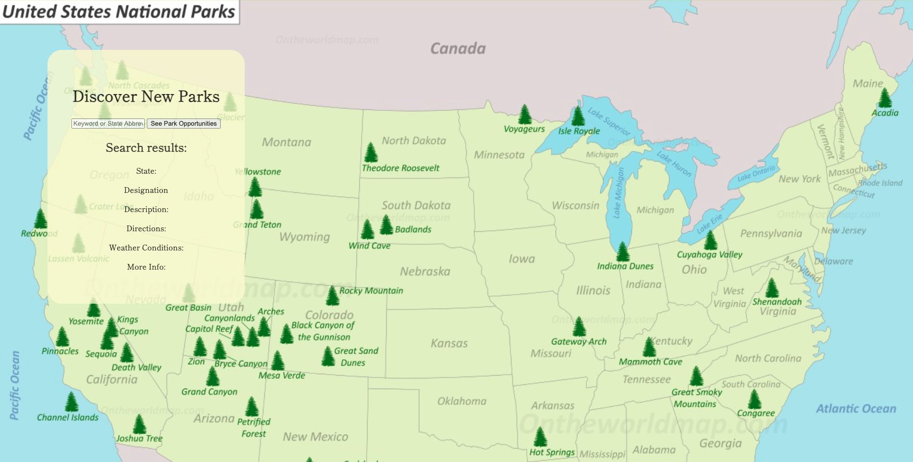
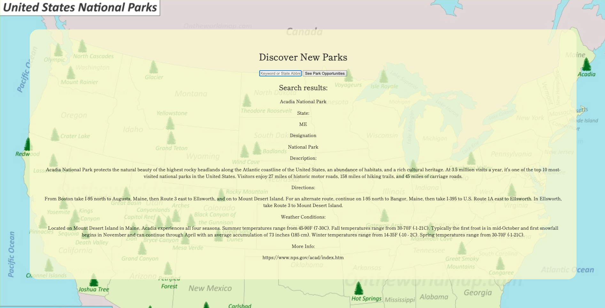

# Nationals Parks Preview

a simple web app that shows NPS properties based on keyword or state abbreviation. 

## Technologies Used
HTML5
CSS3
JS
Jquery
NPS API https://www.nps.gov/subjects/developer/get-started.htm 
Git/Github/Github Pages (for deployment)

## Screenshots

## Getting Started:
[click](https://garrettruss.github.io/NPS-Project/) to see the app. 

## Future Enhancements
Display more than one result. 
Impliment pagination.
Impliment modar or card desk system to display more than one result. 